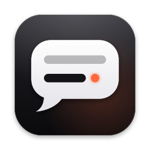
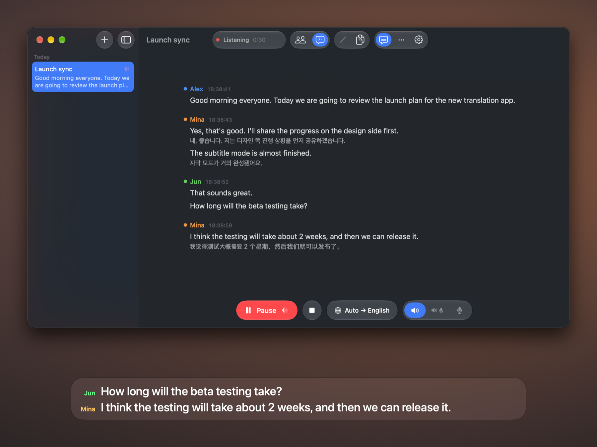
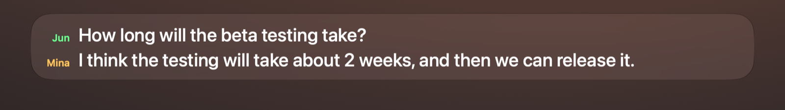

<p align="center">
  
</p>

<h1 align="center">Luka</h1>

<p align="center">
  <strong>Live captions for everything your Mac hears.</strong><br>
  Transcribes and translates calls, videos and meetings as they happen, and tells you who is talking.
</p>

<p align="center">
  
  
  
  <a href="LICENSE"></a>
</p>

<p align="center">
  <b>English</b> | <a href="docs/README.ko.md">한국어</a> | <a href="docs/README.zh.md">中文</a>
</p>

<p align="center">
  
</p>

---

## Install

1. Download `Luka-<version>.dmg` from [Releases](../../releases) and drag **Luka** into **Applications**.
2. Open Luka. Builds aren't notarized yet, so macOS stops the first launch:
   **System Settings › Privacy & Security** → scroll down → **Open Anyway**.
   Or once in Terminal: `xattr -dr com.apple.quarantine /Applications/Luka.app`
3. Paste a [Soniox API key](https://console.soniox.com) into the first window.
4. Press <kbd>⌃</kbd><kbd>⌥</kbd><kbd>N</kbd> and allow **System Audio Recording** when asked.

Requires macOS 15 or newer; Liquid Glass on macOS 26. Soniox bills per audio hour ([pricing](https://soniox.com/pricing)).

## Captions

<p align="center">
  
</p>

A glass strip that floats over any app, full-screen video included, and never takes focus.
It appears when Luka starts listening and fades out when you finish; <kbd>⌃</kbd><kbd>⌥</kbd><kbd>C</kbd> hides it anytime.

| Do | Result |
| --- | --- |
| Drag the top or bottom edge | Add or remove lines (1–6) |
| Drag a side | Resize width |
| Drop near screen center | Snaps to center |
| Hover | Controls for language, source, size and lock |
| Click a speaker name | Rename them, everywhere, live |
| Lock <kbd>⌃</kbd><kbd>⌥</kbd><kbd>L</kbd> | Click-through; hover shows **Unlock** |

## Sessions

Every transcription is a session in the sidebar, saved as you go.
Click the title to rename it. Finish with <kbd>⌘</kbd><kbd>.</kbd>, then **Continue** later, edit lines, or copy everything with <kbd>⇧</kbd><kbd>⌘</kbd><kbd>C</kbd>.

Speakers split by mistake? Open a name and choose **Same person as…**.

## Shortcuts

Work from any app:

| Keys | Action |
| --- | --- |
| <kbd>⌃</kbd><kbd>⌥</kbd><kbd>N</kbd> | New transcription |
| <kbd>⌃</kbd><kbd>⌥</kbd><kbd>R</kbd> | Start / pause |
| <kbd>⌃</kbd><kbd>⌥</kbd><kbd>C</kbd> | Show / hide captions |
| <kbd>⌃</kbd><kbd>⌥</kbd><kbd>T</kbd> | Show / hide transcript |
| <kbd>⌃</kbd><kbd>⌥</kbd><kbd>L</kbd> | Lock / unlock captions |

Inside Luka: <kbd>⌘</kbd><kbd>E</kbd> names whoever is speaking, <kbd>⌘</kbd><kbd>1</kbd> / <kbd>⌘</kbd><kbd>2</kbd> toggle windows, <kbd>⌘</kbd><kbd>+</kbd> <kbd>⌘</kbd><kbd>−</kbd> text size, <kbd>⌘</kbd><kbd>↑</kbd> <kbd>⌘</kbd><kbd>↓</kbd> caption lines.

## Modes

| Mode | For |
| --- | --- |
| Translate | Any spoken language → one language |
| Two-way | Conversations: each side translated to the other |
| Transcribe | Write it down, no translation |

Listen to Mac audio, the microphone, or both. The interface speaks English, 한국어 and 中文.

## Privacy

Audio goes straight from your Mac to Soniox over WebSocket; there is no Luka server.
The API key is AES-GCM encrypted in `~/Library/Application Support/Luka/`, sessions are JSON files next to it.

## Build from source

```sh
./scripts/build-app.sh --install   # ~/Applications/Luka.app
./scripts/build-app.sh --dmg       # build/Luka-<version>.dmg
swift test                         # replays recorded Soniox streams
```

Builds with Xcode 26 / Swift 6.2 and runs on macOS 15+. Debug flags: `--feed file.pcm` streams a 16 kHz mono file instead of live audio.

## License

MIT
